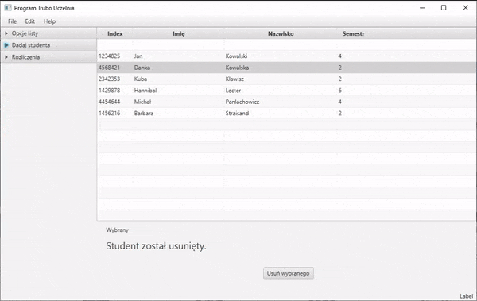

## Uczelnia is a JavaFX project. Simple student manager appication with database suppport.

Technologies used:

You can add new student, check if he paid for school, delete them, and that is pretty much it.

---

Build entirely for fun and to learn new technology.
